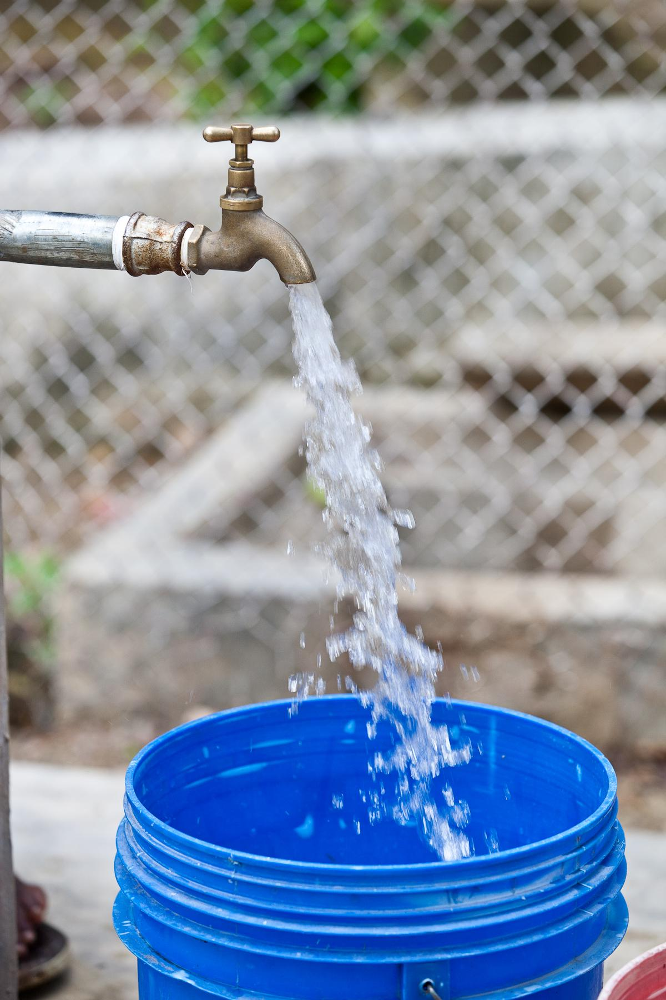

# Pump it Up: Tanzanian Water Wells(Data Mining the Water Table)

Tanzania is a developing country which has a clean water problem. According to [worldometers.info](https://www.worldometers.info/world-population/tanzania-population/), Tanzania population is 59,353,795 and it has to provide more than 59 million people with clean water. There are many water features which are already well established, but also there are many useless wells or some are in need of repair. 

**Problem:**

25 million of this population have lacks access to clean water, 40 million people also have a lack access to improved sanitation. Water is a basic need and for human beings. The Tanzanian Water Ministry agreed with Taarifa and they aimed to solve this problem by improving clean water sources. There are many water wells already established, but some of them are non-functional or needs repair.

**Aim:**

The project's aim is to build a model which tells the status of the water points (as functional, nonfunctional, functional but needs repair). With this model, we will help to the Tanzanian Authorities how to use water sources as a productive way. It also generally helps the both public, private and nn-profit organiszations invest on Tanzania water resources wisely.

**Data:** 

The original data was obtained from the [DrivenData 'Pump it Up: Data Mining the Water Table'](https://www.drivendata.org/competitions/7/pump-it-up-data-mining-the-water-table/page/23/) competition. Basically, there are 4 different data sets; submission format, training set, test set and train labels set which contains status of wells. With given training set and labels set, competitors are wanted to build predictive model and apply it to test set to determine status of the wells and submit.

In this project, I used train set and train label set which have 59400 water points data with 40 features. 

**Plan:**

 1. Understanding Data
 
 2. Cleaning and Exploring Data
 
 3. Preparing Data to Modeling
 
 4. Finding Binary Model & Baseline 
 
 5. Ternary Target Modeling
 
***Metric:*** The metric of the competition was defined as balanced accuracy. So, we choose this metric and also to make sure about our results we also used ROC-AUC score to see our model works well or not.

***Understanding Data:***  First, columns in this data are mostly categorical columns with many unique values not understandable for machines. The first challange is to solve this problem. Second challenge is to handle highly imbalanced multi-target problem. These two challanges came up with the understanding of data.

 ***Cleaning and Exploring Data:*** Mainly, null, zero and missing values changed to mean or collected in a group and named unknown according to nature of the column.
 
 ***Preparing Data to Modeling:*** To prepare our data to machine learning, we did some feature engineering, encoding and scaling for dealing with first challenge. For binary model WoE Encoding and Robust Scaler were used. For, ternary target model, Target Encoder and Robust Scaler used. 
 
 ***Finding Binary Model:*** To make our ternary target modeling easily, first we simplified the problem in binary target. Logistic Regression was chosen as baseline. To see best results, Decision Tree, Extra Trees, Random Forest, XGB, K-Neighbors, LGBM Classifiers were tried. Also, grid search were done for Random Forest and parameter selection was done for gradient boosting models. To improve our model, feature importance was seen also.
 
 ***Ternary Target Modeling:*** For ternary target, Random Forest and XGBoost were tried. To handle the second challange as imbalanced target problem, SMOTE over-sampling technique was applied.
 
 The reasons behind the metric, encoder, scaler, over-sampling and model selections can be found in notebooks in detail. 
 
 **Findings:**
 - The best result for binary problem is taken by using Random Forest with grid search as %85 balanced accuracy on test set. 
 - The best model for ternary model was obtained by XGBoost Classifier with SMOTE over-sampling technique as 86% balanced accuracy on test set.
 - 4272 wells were dried but they have good water quality. With finding a solution to give source again these wells, they can be functional. Finding clean water sources is not the only problem, to continue to feed these sources are equaly important.
 - 2226 (7%) wells have enough and soft water but needs repair. Authorities must invest on repairing. Otherwise these will be non-functional.
 - 8035 (27%) wells has enough, good quality water but they are non-functional. This shows that authorities must work and invest on technology to pump these good sources.
 - Authorties should check again the wells which they funded.
 - New tecqniques must be found to feed dry wells and repair wells.
 
 More detailed findings can be found within https://github.com/fredtush/phase-3-project/blob/main/student.ipynb 
 
 **Future Improvements:**
 
 - Feature selection will be done, and feature engineering on categorical columns will be good idea to handle first challange. 
 - Imbalanced target problem will be solved in more effective way.
 - Parameter optimization will be improved for XGBoost Model to fix overfitting problem.
 - Wells can be monitored well and model can be improved according to more accurate and recent data.
 - Different regions have different factors like climate, rainfall season etc. So, from the main model, different models can be build for each region.
 
 # Repository Guide
 
 **CSV Files:**
 
 The raw data files which obtained by DataDriven can be found ;
 
 https://github.com/fredtush/phase-3-project/tree/main/data
 
 The cleaned data can be found ;
 
 https://github.com/fredtush/phase-3-project/blob/main/data/eda_data.csv
 
 **Notebooks:**
 
 https://github.com/fredtush/phase-3-project/blob/main/student.ipynb
 
 **Presentation:**
 
 Presentation can be found from here in .pdf format ;
 
https://github.com/fredtush/phase-3-project/blob/main/presentation.pdf
  
# Resources 
 
 For all explanations of features : https://www.drivendata.org/competitions/7/pump-it-up-data-mining-the-water-table/page/25/
 
 https://www.drivendata.org/competitions/7/pump-it-up-data-mining-the-water-table/page/23/
 
 http://taarifa.org/
 
 https://www.worldometers.info/world-population/tanzania-population/
 
 https://water.org/our-impact/tanzania/
 
 
 

